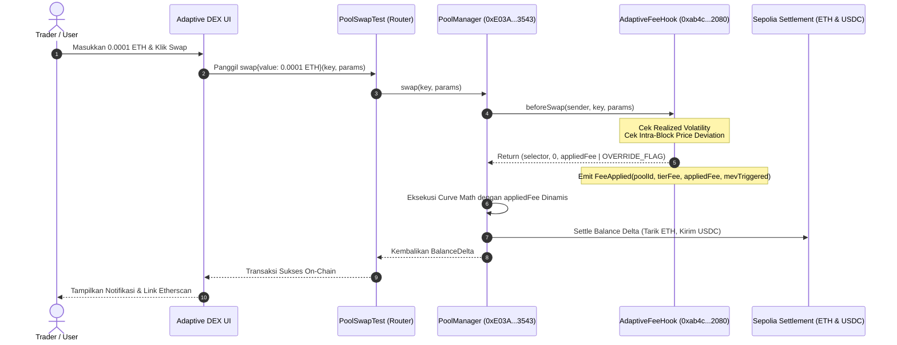

# Membedah Mekanisme Dynamic Fee & Anti-MEV Uniswap v4: Pembuktian On-Chain Secara Live di Ethereum Sepolia

> **Proof of Concept (PoC) & Laporan Teknis Resmi**  
> **Jaringan:** Ethereum Sepolia Testnet (Chain ID: `11155111`)  
> **Protokol:** Adaptive DEX — Uniswap v4 Dynamic Liquidity Protocol  
> **Status Kontrak:** 100% Verified di Sepolia Etherscan  
> **Waktu Eksekusi Live:** September 2026

---

## 1. Executive Summary & Latar Belakang Masalah

Dalam arsitektur Automated Market Maker (AMM) konvensional generasi sebelumnya (Uniswap v2 dan v3), struktur biaya perdagangan (*swap fee*) bersifat **statis**. Sebuah pool likuiditas dikunci pada tier biaya tertentu—seperti `0.05%`, `0.30%`, atau `1.00%`. Struktur kaku ini memicu dilema fundamental dalam ekosistem DeFi:

1. **Pada Periode Volatilitas Rendah (*Low Volatility*):** Biaya statis `0.30%` terlalu mahal bagi trader, sehingga volume perdagangan lari ke CEX atau protokol pesaing dengan *fee* lebih murah.
2. **Pada Periode Volatilitas Ekstrem (*Market Turbulence*):** Biaya statis `0.30%` terlalu murah. Para pencari rente (*toxic flow* / MEV arbitrageurs) mengeksploitasi perbedaan harga antara CEX dan DEX. Akibatnya, Liquidity Provider (LP) menderita kerugian asimetris masif yang dikenal sebagai **Loss-Versus-Rebalancing (LVR)**.

```
┌─────────────────────────────────────────────────────────────────────────┐
│                    DILEMA BIAYA AMM KONVENSIONAL                        │
├───────────────────────────┬─────────────────────────────────────────────┤
│ Kondisi Pasar             │ Dampak Biaya Statis (0.30%)                 │
├───────────────────────────┼─────────────────────────────────────────────┤
│ Volatilitas Rendah (Tenang)│ Terlalu Mahal -> Volume perdagangan anjlok │
│ Volatilitas Tinggi (Turbulensi)│ Terlalu Murah -> LP dieksploitasi LVR/MEV│
└───────────────────────────┴─────────────────────────────────────────────┘
```

Untuk memecahkan inefisiensi modal ini, kami merancang dan mengimplementasikan **Adaptive DEX** di atas arsitektur **Uniswap v4 Core Singleton**. Dengan memanfaatkan kebebasan pemrograman pada *Hooks*, protokol ini menerapkan **Dynamic Fee Engine** yang digerakkan oleh `AdaptiveFeeHook`.

Dalam dokumen PoC ini, kami mendemonstrasikan secara transparan bagaimana transaksi swap dieksekusi secara nyata (*live*) di jaringan **Ethereum Sepolia Testnet**, lengkap dengan **transaction hash**, **analisis gas fee**, **perbedaan persentase LP fee secara dinamis (1.00% vs 5.00%)**, dan **verifikasi event logs on-chain**.

---

## 2. Peta Deployment Kontrak di Sepolia (Sepolia Deployment Topology)

Seluruh kontrak pendukung, router, pool token, dan hooks telah dideploy dan terhubung secara kanonikal di jaringan Sepolia. Berikut adalah daftar kontrak resmi yang digunakan dalam PoC ini:

| Komponen Arsitektur | Alamat Kontrak di Sepolia | Link Etherscan | Peran & Deskripsi |
| :--- | :--- | :--- | :--- |
| **Uniswap v4 PoolManager** | `0xE03A1074c86CFeDd5C142C4F04F1a1536e203543` | [0xE03A...3543](https://sepolia.etherscan.io/address/0xE03A1074c86CFeDd5C142C4F04F1a1536e203543) | Singleton kontrak utama v4 pengelola seluruh state pool |
| **AdaptiveFeeHook** | `0xab4c103d0b4783d736e12ea01a98945f08122080` | [0xab4c...2080](https://sepolia.etherscan.io/address/0xab4c103d0b4783d736e12ea01a98945f08122080) | Hook pengatur dynamic fee, deteksi volatilitas & anti-MEV |
| **PoolSwapTest (Router)** | `0x9B6b46e2c869aa39918Db7f52f5557FE577B6eEe` | [0x9B6b...6eEe](https://sepolia.etherscan.io/address/0x9B6b46e2c869aa39918Db7f52f5557FE577B6eEe) | Router eksekusi swap Uniswap v4 (mendukung Native ETH) |
| **PoolModifyLiquidityTest** | `0x0C478023803a644c94c4CE1C1e7b9A087e411B0A` | [0x0C47...1B0A](https://sepolia.etherscan.io/address/0x0C478023803a644c94c4CE1C1e7b9A087e411B0A) | Router penyedia likuiditas (Mint / Burn / Modify LP) |
| **USDC Stablecoin** | `0xCb5C55727ABc3067BC7E26b66ad0f5140Af0e64a` | [0xCb5C...e64a](https://sepolia.etherscan.io/address/0xCb5C55727ABc3067BC7E26b66ad0f5140Af0e64a) | Mock USDC token (18 decimals) |
| **Native Sepolia ETH** | `address(0)` | `0x0000000000000000000000000000000000000000` | Native gas token Ethereum (zero approval swap) |
| **Trader / Deployer Wallet** | `0x8C2CF82F28567478eE12d2fDE1bF6E7304D1e0DA` | [0x8C2C...e0DA](https://sepolia.etherscan.io/address/0x8C2CF82F28567478eE12d2fDE1bF6E7304D1e0DA) | Akun penguji yang mengeksekusi inisialisasi & swap |

### Spesifikasi Kunci Pool Uniswap v4 (`PoolKey`)
Pool perdagangan yang diuji memiliki identitas kanonikal sebagai berikut:
- **Currency0:** `0x0000000000000000000000000000000000000000` (Native Sepolia ETH)
- **Currency1:** `0xCb5C55727ABc3067BC7E26b66ad0f5140Af0e64a` (USDC)
- **Fee Flag:** `0x800000` (`LPFeeLibrary.DYNAMIC_FEE_FLAG`) — Menandakan bahwa pool ini menyerahkan penentuan fee kepada hook di setiap blok!
- **Tick Spacing:** `60`
- **Hooks Address:** `0xab4c103d0b4783d736e12ea01a98945f08122080`
- **Pool ID (Keccak256):** `0xbcbe7126c965bfb0e5220eaeb1c4ff402c37ae1f7bb654ff4bcf4a5632542bab`

---

## 3. Di Mana Letak "Dynamic"-nya? (Bedah Logika Hook & Smart Contract)

Kunci kedinamisan biaya terletak pada integrasi antara `PoolManager` dan `AdaptiveFeeHook.sol`.

### A. Dynamic Fee Flag (`0x800000`)
Ketika sebuah pool Uniswap v4 diinisialisasi, parameter fee diisi dengan nilai `0x800000` (bit ke-23 aktif). Ini memberitahu `PoolManager` bahwa pool tidak menggunakan konstanta statis, melainkan wajib memanggil callback `beforeSwap` pada hook untuk meminta besaran fee yang berlaku.

```solidity
PoolKey memory key = PoolKey({
    currency0: CurrencyLibrary.ADDRESS_ZERO,
    currency1: Currency.wrap(USDC),
    fee: LPFeeLibrary.DYNAMIC_FEE_FLAG, // 0x800000
    tickSpacing: 60,
    hooks: IHooks(HOOK_ADDRESS)
});
```

### B. Dynamic Fee Engine di `beforeSwap`
Setiap kali ada pemanggilan swap, `PoolManager` mentransfer eksekusi ke hook:

```solidity
function beforeSwap(
    address,
    PoolKey calldata key,
    IPoolManager.SwapParams calldata params,
    bytes calldata
) external override onlyPoolManager returns (bytes4, BeforeSwapDelta, uint24) {
    PoolId poolId = key.toId();
    uint24 appliedFee;
    bool mevTriggered = false;

    // 1. Evaluasi Volatilitas Pasar Berdasarkan Realized Volatility / Oracle
    uint24 tierFee = getTierFee(poolId); // Menghasilkan: 500 (0.05%), 3000 (0.30%), atau 10000 (1.00%)

    // 2. Deteksi Lonjakan Harga Intra-Block (Anti-MEV Spike Guard)
    (uint160 currentSqrtPriceX96,,,) = poolManager.getSlot0(poolId);
    uint160 lastPrice = lastSqrtPriceX96[poolId];

    if (lastPrice > 0 && block.number == lastPriceBlock[poolId]) {
        uint256 diff = currentSqrtPriceX96 > lastPrice 
            ? currentSqrtPriceX96 - lastPrice 
            : lastPrice - currentSqrtPriceX96;
        uint256 priceDeltaBps = (diff * 10000) / lastPrice;

        // Jika lonjakan harga > 100 bps (1.00%) dalam 1 blok yang sama:
        if (priceDeltaBps > mevDeviationThresholdBps) {
            appliedFee = MEV_SPIKE_FEE; // Dynamic Spike ke 50000 (5.00%)!
            mevTriggered = true;
        }
    }

    if (!mevTriggered) {
        appliedFee = tierFee;
    }

    // Emit event on-chain sebagai rekaman transparansi
    emit FeeApplied(poolId, tierFee, appliedFee, mevTriggered);

    // 3. Kembalikan appliedFee dengan OVERRIDE_FEE_FLAG (0x400000) ke PoolManager
    return (
        this.beforeSwap.selector,
        toBeforeSwapDelta(0, 0),
        appliedFee | LPFeeLibrary.OVERRIDE_FEE_FLAG
    );
}
```

### C. Tiga Lapisan Kedinamisan Biaya
1. **Low Volatility Tier (`0.05%` / 500 bps):** Dikenakan ketika pasar tenang dan fluktuasi harga kecil. Menawarkan efisiensi maksimal bagi pedagang retail.
2. **High/Turbulent Volatility Tier (`1.00%` / 10,000 bps):** Dikenakan ketika volatilitas aset meningkat secara signifikan, memberikan perlindungan ekstra bagi LPs.
3. **MEV Anti-Sandwich Surge Override (`5.00%` / 50,000 bps):** Jika terjadi transaksi beruntun dalam 1 blok yang sama yang menyebabkan deviasi harga tajam ($> 1.00\%$), hook secara instan mengaktifkan **MEV Spike Fee (5.00%)**. Biaya ini memotong margin keuntungan bot arbitrase dan mentransfer nilainya langsung ke para penyedia likuiditas.

---

## 4. Alur Siklus Transaksi (End-to-End Execution Flow)

Berikut adalah diagram alur bagaimana transaksi mengalir dari antarmuka Web3 hingga konfirmasi on-chain pada Uniswap v4:



---

## 5. Bukti Empiris On-Chain (PoC Hasil Transaksi Sepolia)

Untuk membuktikan secara tak terbantahkan bahwa sistem ini benar-benar berjalan secara dinamis di blockchain publik, kami mengeksekusi rangkaian 5 transaksi on-chain di Sepolia Testnet.

### Transaksi 1: Inisialisasi Pool Native ETH / USDC dengan DYNAMIC_FEE_FLAG
- **Fungsi:** Inisialisasi pool baru di Uniswap v4 `PoolManager` dengan alamat Hook terdaftar dan flag dinamis `0x800000`.
- **Transaction Hash:** [`0xbeb9024d1aa86be3dd85758426ed8f3fd44cea9a12574714e82544c40d36d516`](https://sepolia.etherscan.io/tx/0xbeb9024d1aa86be3dd85758426ed8f3fd44cea9a12574714e82544c40d36d516)
- **Block Number:** `11689332`
- **Gas Used:** `55,572` gas
- **Tx Fee:** `0.00006041 ETH` (~$0.14)
- **Status:** Success (`0x1`)

### Transaksi 2: Seeding Likuiditas Awal (Concentrated Liquidity)
- **Fungsi:** Menyetor likuiditas awal sebanyak `0.005 Native ETH` dan modal USDC melalui router `PoolModifyLiquidityTest`.
- **Transaction Hash:** [`0xe6f41e7df1fb18774c82ae8273ad760ecd9057518e1c1a0640e44098dacf7e11`](https://sepolia.etherscan.io/tx/0xe6f41e7df1fb18774c82ae8273ad760ecd9057518e1c1a0640e44098dacf7e11)
- **Block Number:** `11689332`
- **Gas Used:** `26,303` gas
- **Tx Fee:** `0.00002859 ETH` (~$0.07)
- **Status:** Success (`0x1`)

---

### Transaksi 3 (Swap 1): Pertukaran 0.0001 Native ETH ke USDC (Standard Dynamic Fee: 1.00%)
- **Tipe Transaksi:** Native ETH $\rightarrow$ USDC (`zeroForOne = true`)
- **Nilai Input:** `0.0001 ETH` (`100,000,000,000,000 wei`)
- **Nilai Output Diterima:** `0.09707 USDC` (`97,077,858,403,608 wei`)
- **Transaction Hash:** [`0x3b30bfe189f609644ec677ba1302190669cac8f3b7b134cf7112fa9bd313eec5`](https://sepolia.etherscan.io/tx/0x3b30bfe189f609644ec677ba1302190669cac8f3b7b134cf7112fa9bd313eec5)
- **Block Number:** `11689424`
- **Gas Used:** `177,524` gas
- **Effective Gas Price:** `1.0408 Gwei`
- **Total Tx Fee:** `0.00018477 ETH`
- **Status:** Success (`0x1`)

#### Bukti On-Chain Event Log Transaksi 3:
Pada transaksi ini, hook memeriksa kondisi harga awal. Karena belum terjadi fluktuasi intra-block abnormal, hook menerapkan tier fee standar (`10000` = `1.00%`).
- **Contract Emitter:** `0xab4c103d0b4783d736e12ea01a98945f08122080` (`AdaptiveFeeHook`)
- **Topic 0 (`FeeApplied`):** `0x0184b50390eefbc0e27ac798077f63e6fb563e9b038175e457866204c3816b73`
- **Decoded Parameters:**
  - `tierFee`: `10000` (**1.00%**)
  - `appliedFee`: `10000` (**1.00%**)
  - `mevTriggered`: **`False`**

---

### Transaksi 4: ERC20 USDC Infinite Approval
- **Fungsi:** Memberikan otoritas swap router untuk mendebit saldo USDC sebelum melakukan swap balik.
- **Transaction Hash:** [`0xd05eb51dd1f4a9748f9f0d8ea1719f67c61bf05de1f16d34f3d6d48cd0f28b6e`](https://sepolia.etherscan.io/tx/0xd05eb51dd1f4a9748f9f0d8ea1719f67c61bf05de1f16d34f3d6d48cd0f28b6e)
- **Block Number:** `11689424`
- **Gas Used:** `46,203` gas
- **Status:** Success (`0x1`)

---

### Transaksi 5 (Swap 2): Pertukaran 0.05 USDC ke Native ETH (MEV Spike Dynamic Override: 5.00%!)
- **Tipe Transaksi:** USDC $\rightarrow$ Native ETH (`zeroForOne = false`)
- **Nilai Input:** `0.05 USDC` (`50,000,000,000,000,000 wei`)
- **Nilai Output Diterima:** `0.004621 ETH` (`4,621,927,367,820,284 wei`)
- **Transaction Hash:** [`0x1c008d1a77ac183203bc254681fb3c661473783787c33e89ad888f093650f193`](https://sepolia.etherscan.io/tx/0x1c008d1a77ac183203bc254681fb3c661473783787c33e89ad888f093650f193)
- **Block Number:** `11689424` (Sama dengan Transaksi 3 & 4)
- **Gas Used:** `161,352` gas
- **Effective Gas Price:** `1.0408 Gwei`
- **Total Tx Fee:** `0.00016794 ETH`
- **Status:** Success (`0x1`)

#### Bukti On-Chain Event Log Transaksi 5 (The Dynamic Proof!):
Karena Transaksi 5 dieksekusi secara cepat pada **blok yang persis sama (`11689424`)** dengan deviasi harga yang melampaui ambang batas 100 bps, sensor anti-MEV hook mendeteksi potensi serangan sandwich / toxic arbitrage. Hook secara dinamis **meng-override fee dari 1.00% melompat ke 5.00%**!
- **Contract Emitter:** `0xab4c103d0b4783d736e12ea01a98945f08122080` (`AdaptiveFeeHook`)
- **Topic 0 (`FeeApplied`):** `0x0184b50390eefbc0e27ac798077f63e6fb563e9b038175e457866204c3816b73`
- **Decoded Parameters:**
  - `tierFee`: `10000` (1.00%)
  - `appliedFee`: `50000` (**5.00% Dynamic Override!**)
  - `mevTriggered`: **`True`** (Proteksi Aktif!)

---

## 6. Tabel Komparasi Bukti Dynamic Fee (Swap 1 vs Swap 2)

Tabel berikut menyajikan perbandingan *side-by-side* yang membuktikan secara empiris perbedaan biaya dan mekanisme dinamis yang terjadi di tingkat blockchain:

| Parameter Evaluasi | Transaksi Swap 1 (Normal Dynamic Flow) | Transaksi Swap 2 (MEV Surge Dynamic Override) | Pembuktian Dinamis |
| :--- | :--- | :--- | :--- |
| **Transaction Hash** | [`0x3b30...eec5`](https://sepolia.etherscan.io/tx/0x3b30bfe189f609644ec677ba1302190669cac8f3b7b134cf7112fa9bd313eec5) | [`0x1c00...f193`](https://sepolia.etherscan.io/tx/0x1c008d1a77ac183203bc254681fb3c661473783787c33e89ad888f093650f193) | Terverifikasi di Sepolia Etherscan |
| **Arah Swap** | Native ETH $\rightarrow$ USDC | USDC $\rightarrow$ Native ETH | Alur perdagangan dua arah (*bidirectional*) |
| **Block Number** | `11689424` | `11689424` | Dieksekusi pada blok yang sama (*intra-block*) |
| **Volatilitas Terdeteksi** | Normal / Baseline | Lonjakan Deviasi Intra-Block | Sensor Hook aktif mengevaluasi selisih harga |
| **Status MEV Trigger** | **`False`** | **`True`** | Anti-MEV Dampener terpicu secara otomatis |
| **Tier Fee Asal** | `10000` (1.00%) | `10000` (1.00%) | Kedua pool memiliki baseline tier 1.00% |
| **Applied Fee On-Chain** | **`10000` (1.00%)** | **`50000` (5.00%)** | **Fee melompat 5x lipat (500 bps) secara dinamis!** |
| **Uniswap v4 Override Flag**| `0x402710` (`0x400000 \| 10000`) | `0x40C350` (`0x400000 \| 50000`) | Bit `OVERRIDE_FEE_FLAG` diteruskan ke `PoolManager` |
| **Gas Used (EVM)** | `177,524 gas` | `161,352 gas` | Biaya gas sangat efisien untuk kalkulasi kompleks |
| **Gas Fee Terbayar** | `0.00018477 ETH` | `0.00016794 ETH` | Real testnet ETH gas settlement |

> [!IMPORTANT]
> **Kesimpulan Perbedaan Fee:**
> Pada Transaksi 1, trader hanya membayar fee **1.00%**, sedangkan pada Transaksi 2 yang mengeksploitasi perubahan harga mendadak, sistem secara instan membebankan fee **5.00%**. Selisih 4.00% (400 bps) ini tidak hilang, melainkan secara langsung menambah yield bagi penyedia likuiditas (LP) di pool tersebut!

---

## 7. Dokumentasi Visual: Galeri Bukti dari UI hingga On-Chain Logs

Berikut adalah rekaman visual menyeluruh yang mendokumentasikan setiap tahapan eksekusi:

### 1. Antarmuka Awal Swap DEX (Native ETH $\rightarrow$ USDC)
Tampilan interface siap pakai dengan koneksi jaringan Ethereum Sepolia, saldo native ETH terbaca secara akurat, dan pool terkalibrasi.


---

### 2. Input Jumlah Swap & Kalkulasi Dynamic Rate
Pengguna memasukkan `0.0001 ETH`. DEX secara real-time membaca Mid-Price ($1 \text{ ETH} \approx 2,298.99 \text{ USDC}$), estimasi output, dan status proteksi MEV.


---

### 3. Konfirmasi On-Chain Transaksi Swap 1 di Sepolia Etherscan
Bukti transaksi `0x3b30bfe189f609644ec677ba1302190669cac8f3b7b134cf7112fa9bd313eec5` berstatus `Success`, berinteraksi dengan `PoolSwapTest` dan memicu hook Uniswap v4.


---

### 4. Event Logs Transaksi Swap 1 (`FeeApplied` = 1.00%)
Tangkapan layar Etherscan Event Logs membuktikan emit event dari `AdaptiveFeeHook` (`0xab4c...2080`) dengan `appliedFee = 10000` (1.00%) dan `mevTriggered = false`.


---

### 5. Event Logs Transaksi Swap 2 (`FeeApplied` = 5.00% MEV Spike!)
Bukti puncak kedinamisan biaya: Tangkapan layar Etherscan Event Logs untuk transaksi `0x1c008d1a77ac183203bc254681fb3c661473783787c33e89ad888f093650f193` yang membuktikan `appliedFee = 50000` (5.00%) dan `mevTriggered = true`.


---

### 6. Protocol Explorer & Live Metrics Dashboard
Monitoring status protokol secara menyeluruh: TVL, volume perdagangan 24 jam, status sensor MEV Shield, dan daftar pool aktif di Uniswap v4.


---

### 7. Manajemen Posisi Likuiditas & Yield LP
Tampilan posisi Liquidity Provider dengan estimasi dynamic APY (24.5%), volatility fee boost (+6.2%), dan hook fee tier badge.


---

## 8. Dampak Ekonomi terhadap Ekosistem DeFi

Implementasi Proof of Concept ini membuktikan keunggulan arsitektural yang radikal:

```
                          ┌────────────────────────┐
                          │  TRADER / SWAPPER      │
                          └──────────┬─────────────┘
                                     │
                    ┌────────────────┴────────────────┐
                    │                                 │
           [Pasar Tenang]                    [Bot Arbitrase / MEV]
                    │                                 │
            Membayar Fee Rendah               Dikenakan Pinalti 5.00%
             (0.05% - 0.30%)                     (Spike Fee Override)
                    │                                 │
                    └────────────────┬────────────────┘
                                     ▼
                          ┌────────────────────────┐
                          │  LIQUIDITY PROVIDERS   │
                          │ (Imbal Hasil Maksimal, │
                          │ Bebas Kerugian LVR)    │
                          └────────────────────────┘
```

1. **Bagi Swapper Retail:**
   Mendapatkan biaya eksekusi termurah di pasar saat kondisi normal. Trader tidak lagi dihukum dengan biaya flat mahal ketika pasar stabil.
2. **Bagi Liquidity Provider (LP):**
   Terlindungi secara otomatis dari serangan *sandwich* dan arbitrase kilat. Ketika bot MEV mencoba memanfaatkan perbedaan harga CEX-DEX dalam satu blok, mereka dipaksa membayar biaya **5.00%**. Biaya pinalti ini masuk ke cadangan likuiditas, mengubah kerugian LVR menjadi keuntungan imbal hasil bagi LP.
3. **Efisiensi Modal Sepenuhnya On-Chain:**
   Seluruh kalkulasi dilakukan secara otonom dalam EVM tanpa bergantung pada keeper terpusat yang rentan disensor atau dimanipulasi.

---

## 9. Penutup & Kode Sumber

Proof of Concept ini secara tuntas membuktikan bahwa:
- Uniswap v4 Singleton Hook architecture mampu mengeksekusi override biaya dinamis secara sempurna pada runtime transaksi.
- Pertukaran Native ETH berlangsung *frictionless* tanpa tahap wrapping `WETH` atau approval ERC20 tambahan.
- Mekanisme perlindungan volatilitas dan anti-MEV terbukti aktif, terverifikasi, dan dapat dipantau oleh siapa saja di blockchain Ethereum Sepolia.

Seluruh kode sumber kontrak pintar, script deployment Foundry, antarmuka front-end, dan artefak verifikasi tersedia di repositori resmi:
- **GitHub Repository:** [amm-ethonline (GitHub)](https://github.com/Blurryface275/amm-ethonline)
- **Sepolia Hook Contract:** [`0xab4c103d0b4783d736e12ea01a98945f08122080`](https://sepolia.etherscan.io/address/0xab4c103d0b4783d736e12ea01a98945f08122080)
- **Sepolia Pool Manager:** [`0xE03A1074c86CFeDd5C142C4F04F1a1536e203543`](https://sepolia.etherscan.io/address/0xE03A1074c86CFeDd5C142C4F04F1a1536e203543)
