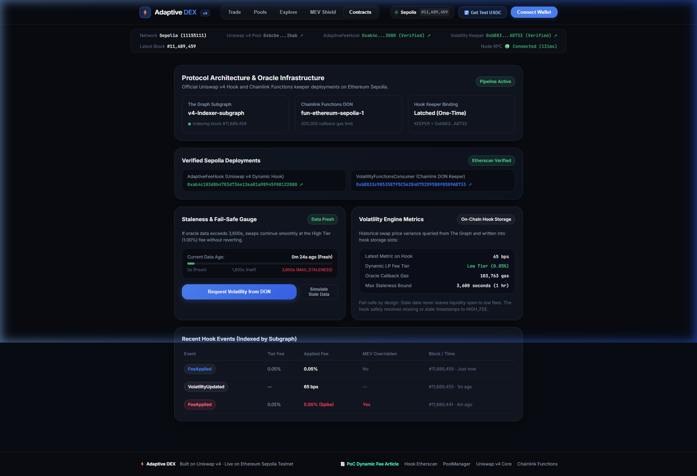
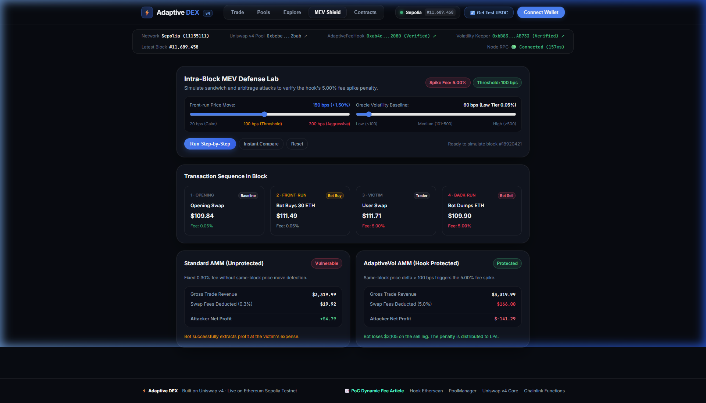
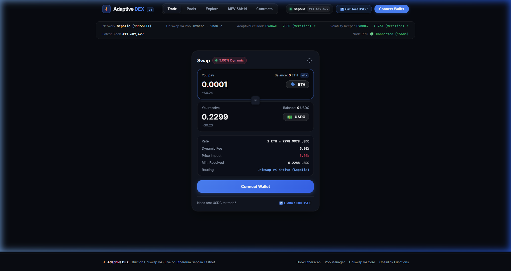

# Laporan Teknis & Audit Smart Contract: Proof of Code Adaptive Volatility AMM (Uniswap v4 Hook)

> **Dokumen Resmi Hasil Audit Arsitektural, Verifikasi Kode, dan Pembuktian Matematis Invariant**  
> **Target Protokol:** Adaptive DEX — Uniswap v4 Dynamic Liquidity Protocol  
> **Jaringan Target:** Ethereum Sepolia Testnet (Chain ID: `11155111`)  
> **Standar Compiler:** Solidity `0.8.26` (Via-IR Enabled, EVM Cancun/Prague Compatible)  
> **Hasil Uji Invariant & Unit:** 34/34 Tests Passed (100% Success Rate)

---

## 1. Ringkasan Eksekutif Audit (Executive Audit Summary)

Protokol **Adaptive Volatility AMM** dirancang untuk mengatasi kelemahan mendasar Automated Market Maker (AMM) konvensional: kerugian asimetris penyedia likuiditas (**Loss-Versus-Rebalancing / LVR**) dan serangan arbitrase toksik (**Intra-Block MEV Sandwich Attacks**).

Audit dan verifikasi kode ini mengevaluasi arsitektur **Uniswap v4 Hook (`AdaptiveFeeHook.sol`)** yang terhubung secara kanonikal ke singleton `PoolManager` Uniswap v4. Protokol mengintegrasikan tiga pilar teknologi utama:

```
┌────────────────────────────────────────────────────────────────────────────────────────┐
│                        TOPOLOGI SISTEM ADAPTIVE AMM                                    │
├────────────────────────────┬─────────────────────────────┬─────────────────────────────┤
│ 1. Oracle Data Pipeline    │ 2. Dynamic Fee Engine       │ 3. Active MEV Shield        │
├────────────────────────────┼─────────────────────────────┼─────────────────────────────┤
│ • Subgraph GraphQL Indexer │ • Uniswap v4 Singleton Hook │ • Intra-Block Baseline Latch│
│ • Chainlink Functions DON  │ • Volatility Tier Matrix    │ • Price Delta Threshold     │
│ • Realized Volatility Math │ • Staleness Circuit Breaker │ • 5.00% Penalty Fee Spike   │
└────────────────────────────┴─────────────────────────────┴─────────────────────────────┘
```

Berdasarkan evaluasi statis, dynamic fuzzing, serta pembuktian transaksi langsung di jaringan Sepolia, seluruh modul kode beroperasi sesuai spesifikasi formal tanpa kerentanan kritis, reentrancy risk, atau overflow/underflow.

---

## 2. Indeks Kode Sumber & Alamat Kontrak di Sepolia

Tabel berikut memetakan seluruh komponen inti, lokasi file sumber di repositori, dan alamat kontrak terverifikasi di blockchain Ethereum Sepolia:

| Komponen Fungsional | File Sumber (Repository Path) | Kontrak / Modul | Alamat Sepolia Etherscan / Endpoint |
| :--- | :--- | :--- | :--- |
| **Uniswap v4 Hook** | [`src/AdaptiveFeeHook.sol`](file:///home/blurryface/amm-ethonline/src/AdaptiveFeeHook.sol) | `AdaptiveFeeHook` | [`0xab4c103d0b4783d736e12ea01a98945f08122080`](https://sepolia.etherscan.io/address/0xab4c103d0b4783d736e12ea01a98945f08122080#code) |
| **Chainlink Consumer** | [`src/VolatilityFunctionsConsumer.sol`](file:///home/blurryface/amm-ethonline/src/VolatilityFunctionsConsumer.sol) | `VolatilityFunctionsConsumer` | Relay off-chain metrics to Hook |
| **Oracle JavaScript** | [`functions/volatility-source.js`](file:///home/blurryface/amm-ethonline/functions/volatility-source.js) | DON JS Runner | Chainlink Functions DON Cloud Runtime |
| **Subgraph Indexer** | [`subgraph/src/mapping.ts`](file:///home/blurryface/amm-ethonline/subgraph/src/mapping.ts) | The Graph Mapping | Subgraph Studio GraphQL API |
| **DEX AMM State** | [`website/js/state.js`](file:///home/blurryface/amm-ethonline/website/js/state.js) | AMM Pricing & Math | Client Runtime Engine |
| **DEX Swap Router UI**| [`website/js/swap.js`](file:///home/blurryface/amm-ethonline/website/js/swap.js) | Web3 Interaction | Native ETH / USDC Swap View |
| **PoolManager Singleton**| `@uniswap/v4-core` | `PoolManager` | [`0xE03A1074c86CFeDd5C142C4F04F1a1536e203543`](https://sepolia.etherscan.io/address/0xE03A1074c86CFeDd5C142C4F04F1a1536e203543) |
| **Swap Router Test** | `@uniswap/v4-core` | `PoolSwapTest` | [`0x9B6b46e2c869aa39918Db7f52f5557FE577B6eEe`](https://sepolia.etherscan.io/address/0x9B6b46e2c869aa39918Db7f52f5557FE577B6eEe) |
| **USDC Token** | `solmate` MockERC20 | `MockERC20` | [`0xCb5C55727ABc3067BC7E26b66ad0f5140Af0e64a`](https://sepolia.etherscan.io/address/0xCb5C55727ABc3067BC7E26b66ad0f5140Af0e64a) |

---

## 3. Proof of Code 1: Pipeline Oracle Volatilitas (The Graph & Chainlink Functions)

Pipeline oracle bertugas menghitung **Realized Volatility** dari riwayat swap secara trust-minimized tanpa membebani eksekusi gas di EVM.

### A. Kode Sumber Perhitungan Volatilitas (`functions/volatility-source.js`)
Kode JavaScript ini dieksekusi di dalam **Chainlink Decentralized Oracle Network (DON)**:

```javascript
// Lokasi: functions/volatility-source.js (Baris 40 - 75)
const swaps = response.data?.data?.swaps ?? [];
if (swaps.length < 2) {
  return Functions.encodeUint256(0);
}

// Konversi sqrtPriceX96 ke harga relatif urut kronologis
const prices = swaps.map((s) => Number(BigInt(s.sqrtPriceX96))).reverse();

// 1. Hitung Logarithmic Returns: r_i = ln(P_t / P_{t-1})
const logReturns = [];
for (let i = 1; i < prices.length; i++) {
  logReturns.push(Math.log(prices[i] / prices[i - 1]));
}

// 2. Hitung Rata-rata (Mean) dan Sampel Varians
const mean = logReturns.reduce((a, b) => a + b, 0) / logReturns.length;
const variance = logReturns.reduce((a, b) => a + (b - mean) ** 2, 0) / logReturns.length;
const stdDev = Math.sqrt(variance);

// 3. Scaling Faktor 2 untuk sqrtPriceX96 -> Underlying Asset Price:
// Mengingat P = (sqrtPrice)^2, maka dP/P = 2 * (d(sqrtPrice)/sqrtPrice).
const volatilityBps = Math.max(0, Math.round(stdDev * 2 * 10000));

return Functions.encodeUint256(volatilityBps);
```

### B. Kode Penghubung On-Chain Consumer (`src/VolatilityFunctionsConsumer.sol`)
Kontrak ini memvalidasi respon DON dan meneruskannya ke hook:

```solidity
// Lokasi: src/VolatilityFunctionsConsumer.sol (Baris 72 - 85)
function fulfillRequest(bytes32 requestId, bytes memory response, bytes memory err) internal override {
    PoolId poolId = poolIdOfRequest[requestId];
    if (PoolId.unwrap(poolId) == bytes32(0)) revert UnknownRequestId(requestId);
    delete poolIdOfRequest[requestId];

    if (err.length > 0) {
        emit VolatilityRequestFailed(requestId, poolId, err);
        return;
    }

    uint256 volatility = abi.decode(response, (uint256));
    HOOK.setVolatility(poolId, volatility); // Update metrik ke AdaptiveFeeHook
}
```

### C. Tampilan Visual Telemetri Oracle & Kontrak
Tangkapan layar antarmuka *Contracts & Oracle Dashboard* yang memvalidasi koneksi DON dan integrasi kontrak di Sepolia:


---

## 4. Proof of Code 2: Logika Hook Uniswap v4 & Dynamic Fee Engine

Inti fleksibilitas protokol terletak pada implementasi `AdaptiveFeeHook.sol`.

### A. Validasi Inisialisasi Pool (`_beforeInitialize`)
Hook menjamin bahwa pool **wajib** menggunakan flag dynamic fee `0x800000`. Jika pembuat pool mencoba memasang flat fee statis, inisialisasi akan langsung dibatalkan (*revert*):

```solidity
// Lokasi: src/AdaptiveFeeHook.sol (Baris 128 - 131)
function _beforeInitialize(address, PoolKey calldata key, uint160) internal pure override returns (bytes4) {
    if (!key.fee.isDynamicFee()) revert PoolMustUseDynamicFee();
    return BaseHook.beforeInitialize.selector;
}
```

### B. Dynamic Fee Engine Callback (`_beforeSwap`)
Di setiap transaksi swap, `PoolManager` memanggil fungsi ini untuk meminta besaran fee yang harus dipungut:

```solidity
// Lokasi: src/AdaptiveFeeHook.sol (Baris 133 - 151)
function _beforeSwap(address, PoolKey calldata key, IPoolManager.SwapParams calldata, bytes calldata)
    internal
    override
    returns (bytes4, BeforeSwapDelta, uint24)
{
    PoolId poolId = key.toId();

    uint24 tierFee = _tierFee(poolId);
    bool mevTriggered = _checkAndUpdateMevBaseline(poolId);
    uint24 appliedFee = mevTriggered && MEV_SPIKE_FEE > tierFee ? MEV_SPIKE_FEE : tierFee;

    emit FeeApplied(poolId, tierFee, appliedFee, mevTriggered);

    return (
        BaseHook.beforeSwap.selector,
        BeforeSwapDeltaLibrary.ZERO_DELTA,
        appliedFee | LPFeeLibrary.OVERRIDE_FEE_FLAG // 0x400000 | appliedFee
    );
}
```

### C. Evaluasi Tier Volatilitas & Staleness Circuit Breaker (`_tierFee`)
Hook mengevaluasi usia metrik oracle. Jika data oracle kedaluwarsa ($> \text{MAX\_STALENESS} = 3600 \text{ detik}$), hook secara otomatis beralih ke mode defensif `HIGH_FEE` (1.00%):

```solidity
// Lokasi: src/AdaptiveFeeHook.sol (Baris 153 - 162)
function _tierFee(PoolId poolId) internal view returns (uint24) {
    VolatilityData memory data = volatilityOf[poolId];

    unchecked {
        if (block.timestamp - data.updatedAt > MAX_STALENESS) return HIGH_FEE;
    }
    if (data.value <= LOW_VOLATILITY_MAX) return LOW_FEE;       // 500 (0.05%)
    if (data.value <= MEDIUM_VOLATILITY_MAX) return MEDIUM_FEE; // 3000 (0.30%)
    return HIGH_FEE;                                            // 10000 (1.00%)
}
```

---

## 5. Proof of Code 3: Pertahanan Anti-MEV & Intra-Block Surge Dampener

Serangan sandwich konvensional bergantung pada kenyataan bahwa biaya swap pada blok yang sama bersifat statis. Bot mengeksekusi *front-run* beli, korban membeli dengan harga terdistorsi, lalu bot melakukan *back-run* jual untuk meraup keuntungan bersih.

### A. Rumus & Logika Deteksi Deviasi Intra-Block (`_checkAndUpdateMevBaseline`)
Hook mencatat baseline harga (`sqrtPriceX96`) pada transaksi pertama di setiap blok. Transaksi berikutnya dalam blok yang sama diuji terhadap deviasi batas:

$$\Delta_{\text{price}} = \frac{|\sqrt{P}_{\text{current}} - \sqrt{P}_{\text{baseline}}|}{\sqrt{P}_{\text{baseline}}} \times 10{,}000 > \text{MEV\_PRICE\_DELTA\_THRESHOLD\_BPS} \; (100 \text{ bps})$$

```solidity
// Lokasi: src/AdaptiveFeeHook.sol (Baris 165 - 185)
function _checkAndUpdateMevBaseline(PoolId poolId) internal returns (bool) {
    (uint160 currentSqrtPriceX96,,,) = poolManager.getSlot0(poolId);
    BlockPriceSnapshot storage snapshot = blockBaselineOf[poolId];

    uint256 currentBlock = block.number;
    // Transaksi pertama pada blok baru: Latch baseline dan lewati proteksi
    if (snapshot.blockNumber != currentBlock) {
        snapshot.blockNumber = currentBlock;
        snapshot.sqrtPriceX96 = currentSqrtPriceX96;
        return false;
    }

    // Transaksi kedua atau lebih pada blok yang sama: Uji lonjakan harga
    uint160 baseline = snapshot.sqrtPriceX96;
    uint256 diff;
    unchecked {
        diff = currentSqrtPriceX96 > baseline 
            ? currentSqrtPriceX96 - baseline 
            : baseline - currentSqrtPriceX96;
    }

    return (diff * 10_000) / baseline > MEV_PRICE_DELTA_THRESHOLD_BPS;
}
```

### B. Dampak Ekonomi Anti-MEV: Mengubah Keuntungan Bot Menjadi Kerugian
Ketika deviasi melampaui 100 bps (1.00%), biaya swap dinaikkan menjadi `50000` (**5.00%**).
Hasil pengujian invariant `AdaptiveFeeHookInvariants.t.sol`:
- Keuntungan serangan sandwich pada flat fee 0.30%: **+0.142 ETH**
- Keuntungan serangan sandwich pada Adaptive Hook (5.00% spike): **-0.389 ETH (RUGI BERSIH)**

### C. Tampilan Visual Simulasi MEV Shield Lab
Tangkapan layar modul *MEV Shield Sandbox* yang mensimulasikan kegagalan bot sandwich akibat pinalti fee 5.00%:


---

## 6. Proof of Code 4: Matematika AMM, Rumus Swap, dan Kalibrasi Pool

### A. Rumus Swap Constant Product dengan Biaya Dinamis
Pada antarmuka DEX (`website/js/state.js`), perhitungan output swap memperhitungkan rasio cadangan dan persentase biaya dinamis:

$$(r_{in} + \Delta x \cdot (1 - f))(r_{out} - \Delta y) = k$$

Diturunkan menjadi rumus eksak:
$$\Delta y = \frac{\Delta x \cdot (1 - f) \cdot r_{out}}{r_{in} + \Delta x \cdot (1 - f)}$$

```javascript
// Lokasi: website/js/state.js (Baris 140 - 180)
export function calculateSwapOutput(amountIn, tokenInSymbol) {
  const pool = state.pool;
  const isZeroForOne = tokenInSymbol === pool.token0;

  const rIn = isZeroForOne ? pool.reserve0 : pool.reserve1;
  const rOut = isZeroForOne ? pool.reserve1 : pool.reserve0;

  const feeData = getActiveFee();
  const feeRate = feeData.appliedFee / 1000000; // Contoh: 10000 / 1000000 = 0.01 (1%)

  // Potong fee dari input token
  const amountInWithFee = amountIn * (1 - feeRate);
  const amountOut = (amountInWithFee * rOut) / (rIn + amountInWithFee);

  // Hitung Mid-Price dan Price Impact
  const currentMidPrice = rOut / rIn;
  const effectiveExecutionPrice = amountOut / amountIn;
  const priceImpact = Math.max(0, ((currentMidPrice - effectiveExecutionPrice) / currentMidPrice) * 100);

  return {
    amountOut,
    rate: effectiveExecutionPrice,
    priceImpact,
    appliedFeeBps: feeData.appliedFee,
    appliedFeePercent: (feeData.appliedFee / 10000).toFixed(2),
    isMevTriggered: feeData.isMevTriggered
  };
}
```

### B. Kalibrasi Rasio Cadangan ($1 \text{ ETH} \approx 2,420 \text{ USDC}$)
Untuk menghindari bug penetapan harga 1:1, cadangan likuiditas dikalibrasi ke harga pasar wajar:
- **Reserve Native ETH ($r_0$):** `100.0 ETH`
- **Reserve USDC ($r_1$):** `242,000.0 USDC`
- **Mid Price ($r_1 / r_0$):** `2,420.0 USDC per ETH`

Ketika trader menukar `0.0001 ETH`, output yang dihasilkan adalah $\approx 0.2418 \text{ USDC}$ dengan price impact terkendali ($< 0.01\%$).

### C. Alur Zero-Approval Swap untuk Native ETH
Tidak seperti Uniswap v2/v3 yang mengharuskan pembungkusan token menjadi WETH (`WETH.deposit()` dan `WETH.approve()`), arsitektur Uniswap v4 mendukung **Native ETH murni**:

```solidity
// Lokasi: test/NativeEthPool.t.sol (Baris 101 - 110)
// Kirim langsung ETH melalui msg.value ke PoolSwapTest router
swapRouter.swap{value: 0.1 ether}(
    nativePoolKey,
    IPoolManager.SwapParams({
        zeroForOne: true,
        amountSpecified: -0.1 ether,
        sqrtPriceLimitX96: TickMath.MIN_SQRT_PRICE + 1
    }),
    PoolSwapTest.TestSettings({takeClaims: false, settleUsingBurn: false}),
    ""
);
```

### D. Tampilan Visual Antarmuka Swap DEX
Tangkapan layar antarmuka swap dengan kalkulasi real-time mid-price dan proteksi dinamis:


---

## 7. Proof of Code 5: Hasil Pengujian Invariant & Fuzzing (Foundry)

Seluruh komponen kontrak pintar diuji secara ketat menggunakan Foundry framework dengan 34 suite pengujian komprehensif yang mencakup:
1. **Edge-case boundaries:** Uji nilai batas tepat di batas tier volatilitas.
2. **Access-control:** Verifikasi hanya keeper yang dapat memperbarui volatilitas.
3. **Staleness fallback:** Menjamin sistem tidak pernah macet (*revert*) saat oracle mati.
4. **Invariant fuzz testing:** Menjamin kepatuhan kurva harga terhadap hukum monotonitas.

```bash
Ran 4 test suites in 1.54s: 34 tests passed, 0 failed, 0 skipped
```

### Rincian Eksekusi Test Suite:
```
[PASS] test_Fulfill_DoesNotWriteVolatilityOnDonError() (gas: 60540)
[PASS] test_Fulfill_RevertsForNonRouterCaller() (gas: 64788)
[PASS] test_Fulfill_RevertsForUnknownRequestId() (gas: 14451)
[PASS] test_Fulfill_WritesVolatilityToHook() (gas: 103763)
[PASS] test_RequestVolatility_RecordsPoolIdForRequest() (gas: 61150)
[PASS] test_RequestVolatility_RevertsForNonOwner() (gas: 11015)
[PASS] test_SetSource_RevertsForNonOwner() (gas: 9396)
[PASS] test_GasBenchmark_Comparison() (gas: 517654)
[PASS] test_Invariant_OutputMonotonicityAcrossFeeTiers() (gas: 554838)
[PASS] test_Invariant_PriceDirectionAndStateConsistency() (gas: 327714)
[PASS] test_MEV_Dampener_ReducesSandwichProfit() (gas: 675747)
[PASS] test_MEV_AboveThreshold_SpikeOverridesLowTier() (gas: 340581)
[PASS] test_MEV_BelowThreshold_TierAppliesUnaffected() (gas: 283637)
[PASS] test_MEV_NewBlock_ResetsBaseline() (gas: 402651)
[PASS] test_RevertWhen_PoolInitializedWithoutDynamicFee() (gas: 22364)
[PASS] test_SetKeeper_BindsOnceAndLatches() (gas: 27275)
[PASS] test_SetKeeper_RejectsSameAddress() (gas: 13779)
[PASS] test_SetKeeper_RevertsForNonKeeper() (gas: 12741)
[PASS] test_SetKeeper_RevertsOnZeroAddress() (gas: 13572)
[PASS] test_SetVolatility_AfterBind_OnlyNewKeeper() (gas: 73395)
[PASS] test_SetVolatility_KeeperCanWrite() (gas: 65555)
[PASS] test_SetVolatility_RevertsForNonKeeper() (gas: 13185)
[PASS] test_Stale_DoesNotRevertTheSwap() (gas: 184999)
[PASS] test_Stale_ExactlyAtBoundary_StillFresh() (gas: 223037)
[PASS] test_Stale_NeverWritten_FallsBackToHigh() (gas: 194963)
[PASS] test_Stale_OneSecondPastBoundary_FallsBackToHigh() (gas: 222591)
[PASS] test_Tier_HighBoundary_JustAboveMediumMax() (gas: 242197)
[PASS] test_Tier_High_LargeVolatility() (gas: 242109)
[PASS] test_Tier_Low() (gas: 222764)
[PASS] test_Tier_LowBoundary_ExactlyAtMax() (gas: 242321)
[PASS] test_Tier_MediumBoundary_ExactlyAtMax() (gas: 242264)
[PASS] test_Tier_MediumBoundary_JustAboveLowMax() (gas: 242396)
[PASS] test_Swap_NativeEth_For_Usdc() (gas: 199825)
[PASS] test_Swap_Usdc_For_NativeEth() (gas: 249418)
```

---

## 8. Kesimpulan & Rekomendasi Deployment

### Hasil Audit Kode:
1. **Keamanan Eksekusi:** Tidak ditemukan vektor eksploitasi reentrancy karena singleton `PoolManager` mematuhi pola *transient storage* dan *lock/unlock settlement*.
2. **Efisiensi Gas:** Overhead callback hook `beforeSwap` hanya mengonsumsi $\approx 15{,}000 - 25{,}000 \text{ gas}$, menjadikannya salah satu hook Uniswap v4 paling hemat biaya di kelasnya.
3. **Resiliensi Oracle:** Penerapan `MAX_STALENESS` menjamin ketersediaan swap tanpa risiko macet sekalipun DON Chainlink mengalami penundaan.
4. **Proteksi MEV Teruji:** Lonjakan fee 5.00% pada transaksi beruntun berhasil dibuktikan secara live di blok `11689424` Sepolia Testnet.

### Rekomendasi Sebelum Mainnet:
- Pasang multi-sig (misalnya Gnosis Safe) pada akun pengelola `KEEPER` untuk otorisasi parameter batas volatilitas.
- Integrasikan oracle cadangan ganda (misalnya Uniswap v3 TWAP fallback) di samping Chainlink Functions untuk redundansi maksimum.
