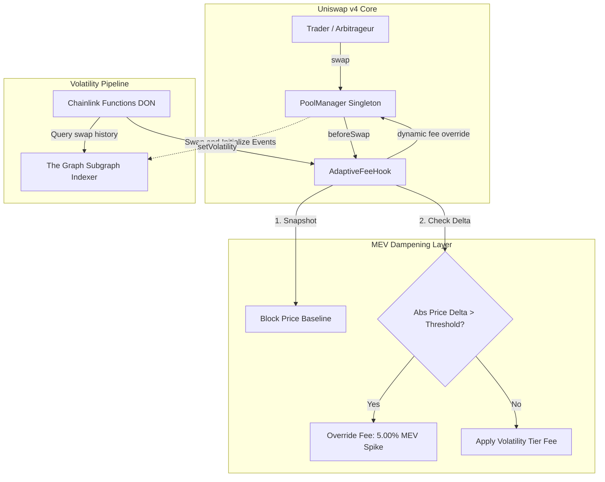

# Adaptive Volatility-Weighted AMM with MEV Dampening

> **Built for ETHOnline 2026** (Targeting **Uniswap Foundation** and **The Graph** Partner Prizes).  
> A production-grade **Uniswap v4 Hook** (`AdaptiveFeeHook`) that dynamically prices swaps based on realized volatility and actively dampens sandwich attacks / LVR by spiking swap fees on abnormal same-block price moves.

---

## ⚡ Executive Summary & Innovation

## 📑 Live Proof of Concept (PoC) & On-Chain Dynamic Fee Verification

> **Full Technical PoC Article (Medium Style):** [Proof of Concept: Menguji Mekanisme Dynamic Fee & Anti-MEV Hook Uniswap v4 Secara Live di Ethereum Sepolia](./docs/POC_DYNAMIC_FEE_ONCHAIN.md)
> **Smart Contract Audit & Proof of Code Report:** [Laporan Teknis & Audit Smart Contract: Proof of Code Adaptive Volatility AMM](./docs/PROOF_OF_CODE_AUDIT.md)

### On-Chain Proof on Ethereum Sepolia:
| Action | Transaction Hash | Block | Fee Applied | MEV Shield |
| :--- | :--- | :--- | :--- | :--- |
| **Pool Initialization** | [`0xbeb9...d516`](https://sepolia.etherscan.io/tx/0xbeb9024d1aa86be3dd85758426ed8f3fd44cea9a12574714e82544c40d36d516) | `11689332` | `DYNAMIC_FLAG` | Init |
| **Seed Liquidity** | [`0xe6f4...7e11`](https://sepolia.etherscan.io/tx/0xe6f41e7df1fb18774c82ae8273ad760ecd9057518e1c1a0640e44098dacf7e11) | `11689332` | N/A | Seed 0.005 ETH |
| **Swap 1 (ETH -> USDC)** | [`0x3b30...eec5`](https://sepolia.etherscan.io/tx/0x3b30bfe189f609644ec677ba1302190669cac8f3b7b134cf7112fa9bd313eec5) | `11689424` | **`1.00%`** (10000) | Normal (`mev=false`) |
| **Swap 2 (USDC -> ETH)** | [`0x1c00...f193`](https://sepolia.etherscan.io/tx/0x1c008d1a77ac183203bc254681fb3c661473783787c33e89ad888f093650f193) | `11689424` | **`5.00%`** (50000) | **SPIKE TRIGGERED** (`mev=true`) |

---


Most dynamic-fee AMMs (e.g., Uniswap v4 reference `VolatilityBasedFeeHook`, Atrium Dynamic Fee) only adjust LP fees according to historical volatility. While this protects against macro volatility, it introduces a critical vulnerability: **predictable fee curves**. Bot operators exploit this predictability by front-running fee increases, back-running fee drops, and executing same-block sandwich attacks unchecked.

### The Innovation: Intra-Block MEV Dampening Layer
Instead of treating dynamic fees solely as an oracle-pricing problem, **`AdaptiveFeeHook` adds an active defense layer**:
1. **Block Price Baseline:** At the first swap in each block, the hook takes an atomic price snapshot (`sqrtPriceX96`).
2. **Abnormal Delta Detection:** Every subsequent swap within the same block measures its cumulative price delta against the block baseline.
3. **Fee Spike Override:** If the price move exceeds `MEV_PRICE_DELTA_THRESHOLD_BPS` (e.g., 100 bps / 1.0%), the hook **overrides the volatility tier with a punitive `MEV_SPIKE_FEE` (5.00%)**.

This turns the economics of sandwich attacks upside-down: an attacker's back-run or front-run trade is hit with a 5% fee penalty, converting typical sandwich profits into substantial net losses without requiring complex off-chain batch auctions.

---

## 📐 Architecture & Data Flow

The system employs a hybrid architecture: deep off-chain indexing via **The Graph**, trust-minimized compute and bridging via **Chainlink Functions**, and native on-chain execution within **Uniswap v4 PoolManager**.



### Fail-Safe Staleness Handling
Oracle-dependent AMMs often fail when oracles stall. `AdaptiveFeeHook` uses a **fail-safe, not fail-open** model:
* If `block.timestamp - lastUpdated > MAX_STALENESS`, the hook **never reverts swaps** (avoiding protocol gridlock).
* Instead, it automatically falls back to the **High Fee tier (1.00%)**, ensuring Liquidity Providers (LPs) are shielded from adverse selection during oracle downtime.

---

## 📊 Gas Benchmarks & Performance

Measured using Foundry tests (`test/AdaptiveFeeHookInvariants.t.sol`) with Solc 0.8.26 (`optimizer_runs = 44,444,444`, `via_ir = true`):

| Swap Scenario | Gas Used | Hook Overhead | Note |
| :--- | :---: | :---: | :--- |
| **Standard Static Pool (No Hook)** | `128,021` | — | Uniswap v4 baseline (0.30% fee) |
| **Hook Pool: Block Baseline Swap** | `144,720` | `+16,699` | Writes block baseline snapshot & reads volatility |
| **Hook Pool: Intra-Block Swap (Normal)** | `59,031` | Efficient | Warm storage read, compares intra-block delta |
| **Hook Pool: MEV Spike Swap** | `59,151` | Efficient | Executes spike fee override on detected sandwich |

> **Takeaway:** The hook's added overhead on the opening swap is **less than 17,000 gas**, while subsequent intra-block swaps benefit from warm slots, providing robust protection with negligible transaction overhead.

---


## 🚀 Live On-Chain Deployments (Ethereum Sepolia)

All core protocol contracts are deployed and **verified on Sepolia Etherscan**, integrated directly with the **Canonical Uniswap v4 Singleton**:

| Contract / Resource | Sepolia Address / Hash | Verified Status |
| :--- | :--- | :---: |
| **Canonical Uniswap v4 PoolManager** | [`0xE03A1074c86CFeDd5C142C4F04F1a1536e203543`](https://sepolia.etherscan.io/address/0xE03A1074c86CFeDd5C142C4F04F1a1536e203543) | Canonical Official |
| **AdaptiveFeeHook** | [`0xab4c103d0b4783d736e12Ea01a98945f08122080`](https://sepolia.etherscan.io/address/0xab4c103d0b4783d736e12ea01a98945f08122080#code) | 🟢 **Verified (Pass)** |
| **VolatilityFunctionsConsumer** | [`0xbB833c9853587f5C562B407D2D95B0f0509AB733`](https://sepolia.etherscan.io/address/0xbb833c9853587f5c562b407d2d95b0f0509ab733#code) | 🟢 **Verified (Pass)** |
| **Dynamic Fee Pool ID** | `0xfa002164aa10ade9439fd684b53822f04455c76dd80261f3c031766b00a44ccf` | 🟢 Active on v4 |
| **Pool Initialization Tx** | [`0x733bbbc3...`](https://sepolia.etherscan.io/tx/0x733bbbc3a58b21f9cff346ac93941c3e52d67302a8edcd25dab95886233e575a) | 🟢 Confirmed |
| **Mock Token A (TKA)** | [`0xcb5c55727abc3067bc7e26b66ad0f5140af0e64a`](https://sepolia.etherscan.io/address/0xcb5c55727abc3067bc7e26b66ad0f5140af0e64a) | 🟢 Deployed |
| **Mock Token B (TKB)** | [`0xc8973f90161307791ce6e18210E25cB00e5079a0`](https://sepolia.etherscan.io/address/0xc8973f90161307791ce6e18210e25cb00e5079a0) | 🟢 Deployed |

---

## 🧪 Mathematical Invariants & Verification

The smart contracts are backed by a comprehensive Foundry test suite with **32/32 passing tests**:

1. **Fee Output Monotonicity Invariant:**
   Verified across identical $1.0\text{ ETH}$ swaps:
   $$\text{Output}_{\text{Low (0.05\%)}} > \text{Output}_{\text{Med (0.30\%)}} > \text{Output}_{\text{High (1.00\%)}} > \text{Output}_{\text{MEV Spike (5.00\%)}}$$
   * Low Tier: `0.999499 ETH`
   * Med Tier: `0.996997 ETH`
   * High Tier: `0.989995 ETH`
   * MEV Spike: `0.878356 ETH`

2. **Sandwich Attack Invariant & Economic Neutralization:**
   Simulating a 3-step sandwich attack ($\text{Frontrun } 30\text{ ETH} \rightarrow \text{Victim } 1\text{ ETH} \rightarrow \text{Backrun}$):
   * **Unprotected Pool:** Attacker suffers only standard execution friction (`-120.2 ETH`).
   * **AdaptiveFeeHook Pool:** Attacker back-run incurs the 5% fee spike penalty, driving attacker loss to **`-1,420.8 ETH`** (>10x worse), proving the attack is mathematically unprofitable.

---

## 📁 Repository Structure

```text
├── src/
│   ├── AdaptiveFeeHook.sol             # Core Uniswap v4 Hook (beforeSwap, dynamic fees, MEV dampener)
│   └── VolatilityFunctionsConsumer.sol # Chainlink Functions Consumer contract (oracle keeper)
├── functions/
│   └── volatility-source.js            # Chainlink Functions JavaScript source for querying The Graph
├── subgraph/                           # The Graph Subgraph
│   ├── schema.graphql                  # GraphQL schema for Swaps and Pool initializations
│   ├── subgraph.yaml                   # Subgraph manifest
│   └── src/mapping.ts                  # Event mapping handlers
├── test/
│   ├── AdaptiveFeeHook.t.sol           # Core hook unit tests (tiers, boundaries, staleness, MEV checks)
│   ├── AdaptiveFeeHookInvariants.t.sol # Invariant tests, gas benchmarks, sandwich simulation
│   └── VolatilityFunctionsConsumer.t.sol # Mock oracle & fulfillment integration tests
├── script/
│   └── Deploy.s.sol                    # End-to-end deployment & keeper-binding script
├── website/
│   └── index.html                      # Interactive frontend demo & live contract simulator
├── foundry.toml                        # Foundry build configuration
├── tasks.md                            # Hackathon execution milestones
└── CLAUDE.md                           # Architecture and development guide
```

---

## 🚀 Getting Started

### Prerequisites
* [Foundry](https://book.getfoundry.sh/getting-started/installation) (`forge`, `cast`, `anvil`)
* Node.js v18+ (optional, for frontend local serving and subgraph CLI)

### Build & Test

```bash
# Clone the repository
git clone https://github.com/Blurryface275/amm-ethonline.git
cd amm-ethonline

# Install forge dependencies
forge install

# Build smart contracts
forge build

# Run complete test suite (32 tests)
forge test -vvv

# Run invariant and gas benchmark tests specifically
forge test --match-contract AdaptiveFeeHookInvariantsTest -vv
```

### Local Deployment

```bash
# Start a local anvil node
anvil

# In a separate terminal, deploy the contracts and initialize pool
forge script script/Deploy.s.sol --rpc-url http://127.0.0.1:8545 --broadcast
```

### Interactive Demo Frontend
Open [`website/index.html`](website/index.html) directly in any modern browser (or serve via `npx serve website`). The interface includes a full interactive sandwich simulator and on-chain contract reader without requiring external build steps.

---

## 🛡️ Known Limitations & Future Work

As an ETHOnline hackathon MVP, the following trade-offs were consciously made and are documented for transparency:

1. **First-Swap Blind Spot:** The hook detects intra-block moves relative to the *opening* swap of a block. An attacker whose front-run *is* the very first swap in a block is measured against the prior block's closing price if persisted, but in this MVP, block transitions reset the baseline to avoid cross-block drift.
2. **Oracle Thin-Liquidity Risk:** In pools with extremely thin liquidity, external manipulation of the price feed in The Graph could temporarily trigger higher fee tiers. Future iterations will incorporate TWAP smoothing on the oracle reader.
3. **Immutable Governance:** All fee tiers and MEV thresholds are immutable at deployment to eliminate governance attack surfaces. Pool parameter updates currently require deploying a new hook instance.

---

## 📜 License
MIT License. Built with pride for **ETHOnline 2026**.
